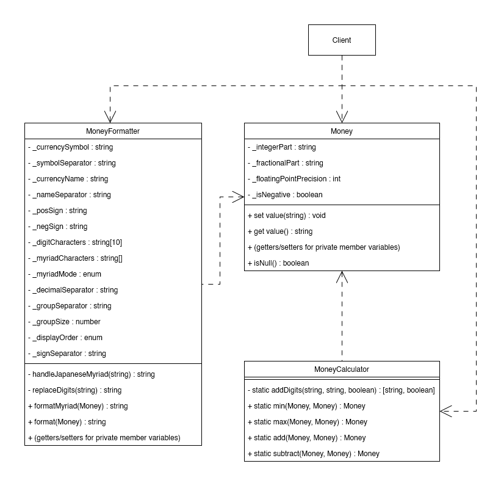

# money-calculator
This is a library for doing artihmetic on currencies in a safe way.
Also has formatting capabilites. WIP. Wait until first release before using.


## Notes On Development Routine
First you need to clone the repo and install the dev-dependencies by running:
```bash
npm install
```
This if course requires you to install node.js first.
Once that has finished you should have all the necessary tools for development.

The files of the library can be found in the src folder. We are using webpack to
build and bundle these files. But you don't need to worry about that because
we will be using pre-configured npm scripts for development. These scripts can be
found in the package.json file.

At the moment we are building 3 different versions of the library from our sources.
Each version is intended for use in different scenarios so each one is imported in
different ways. See usage section for details. Keep in mind that you have to use the
webpack-dev-server for testing to avoid CORS policy errors.

Inside the tests folder you can write all your test cases. Keep them limited to that
folder and use the built files from the dist folder.

When adding new features or fixing bugs please keep in mind the current architecture of the software:



## How to Use
This library is currently released in 3 versions: a umd version, a commonjs version,
and a vanilla version using a global variable.
### Regular JavaScript
This is the most bare-bones way of using this library. Simply import library in your
HTML file before using it like so:
```HTML
<script src="/path/to/library/money_calculator.js"></script>
<script src="fileUsingLibrary.js"></script>
```
The library will then be available under the global variable `MoneyCalculator`.

### CommonJS
This is mostly intended for use in Node applications. Simply import the respective file:
```JavaScript
import myLibrary from "/path/to/library/money_calculator.commonjs.cjs";
```
Then you can use the library under the name `myLibrary` or whatever you choose to name it.

### UMD
This is among other uses intended for importing with es6. To use the import feature
in a browser, make sure to make your script using the library a module:
```HTML
<script src="myFile.js" type="module"></script>
```
Then inside `myFile.js` you can import the library like this:
```JavaScript
import "../dist/money_calculator.umd.js";
```
Then you can just use the library functions directly.
